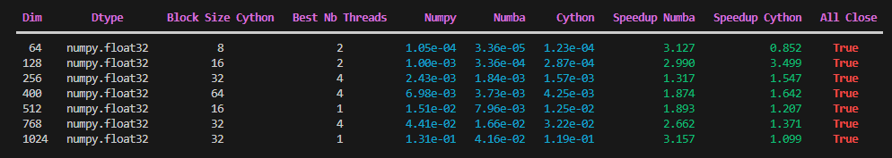
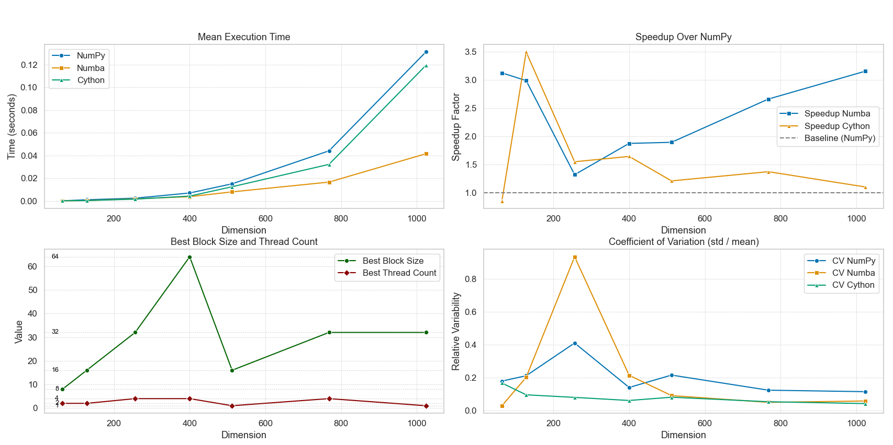

# 🧠 Attention Benchmark

Ce projet développe une stratégie de benchmarking adaptatif pour optimiser le mécanisme d’attention :

$$
\text{Attention}(Q, K, V) = \text{softmax}\left( \frac{Q K^\top}{\sqrt{d_k}} \right) V
$$

Le but est de comparer différentes implémentations (NumPy, Numba, Cython) en mesurant leur performance sur une gamme de dimensions d’entrée.  
Pour l'implémentation Cython, le benchmark repose sur un **algorithme génétique** qui explore intelligemment l’espace des hyperparamètres 
(nombre de threads `nb_thread`, taille de bloc `block_size`, et type flottant `dtype`) afin d’identifier les combinaisons les plus performantes.

L’approche adaptative permet d’obtenir automatiquement, pour chaque configuration testée, les paramètres Cython qui maximisent les performances.

---

## 📁 Structure du projet

```
attention-benchmark/
├── README.md
├── rapport_benchmark.pdf        # Project report
├── requirements.txt
├── setup.py
├── benchmark.py                 # Main benchmark script
├── run.py                       # Entry point for launching benchmarks / tuning
├── attention/                   # Package folder
│   ├── __init__.py
│   ├── numpy_impl.py            # NumPy reference implementation
│   ├── numba_impl.py            # Numba-optimized implementation
│   ├── cython_impl.pyx          # Cython interface
│   ├── cython_impl.cpp          # C++ implementation
│   ├── mmat_impl.cpp            # C++ matrice multiplication
│   ├── mmat_impl.h              
├── results/                     # Folder to save output CSVs, plots, etc.
│   ├── timings_summary.csv
│   └── plots/
├── .gitignore
```

---

## 🚀 Installation

### 1. Cloner le dépôt

```bash
git clone https://github.com/votre-utilisateur/attention-benchmark.git
cd attention-benchmark
```
### 2. Installer les librairies

```bash
pip install -r requirements.txt
```

### 2. Compiler le cython de .pyx ver .cpp

```bash
python setup.py build_ext --inplace
```

### 4. Lancer le benchmark

```bash
python run.py
```

### 5. Lancer les plots

```bash
python results/plots.py
```

---

## Résultats du Benchmark

Voici un aperçu des performances mesurées pour différentes tailles de matrices et types d'implémentations :

#### 📊 Tableau des temps d'exécution moyens


#### 📈 Graphique comparatif des implémentations



## Contributeurs

- Cournil Arnaud
- Deroo Marc
- Vong Laurent


